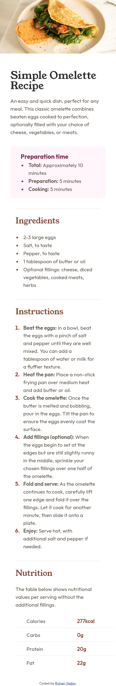
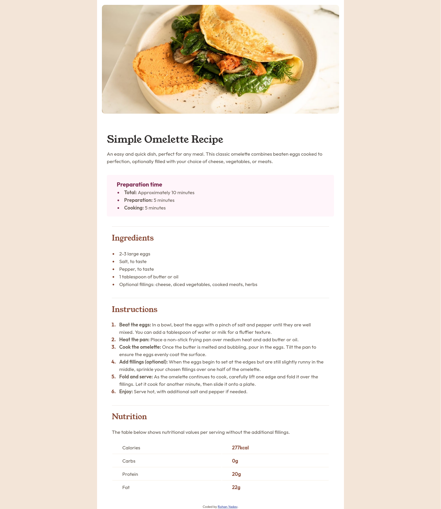

# Frontend Mentor - Recipe page solution

This is a solution to the [Recipe page challenge on Frontend Mentor](https://www.frontendmentor.io/challenges/recipe-page-KiTsR8QQKm). Frontend Mentor challenges help you improve your coding skills by building realistic projects.

## Table of contents

-   [Overview](#overview)
    -   [The challenge](#the-challenge)
    -   [Screenshot](#screenshot)
    -   [Links](#links)
-   [My process](#my-process)
    -   [Built with](#built-with)
    -   [What I learned](#what-i-learned)
-   [Author](#author)

## Overview

### Screenshot

-   Mobile View

    -   

-   Desktop View
    -   

### Links

-   Solution URL: [hosted on github](https://github.com/r-yadav01/fm--recipe-page)
-   Live Site URL: [live on github pages](https://r-yadav01.github.io/fm--recipe-page/)

## My process

### Built with

-   Semantic HTML5 markup
-   Vanilla CSS
-   Mobile-first workflow

### What I learned

I learned about a new css selector using which I can style the list elements markers like the numbers in <ol> and the dots in <ul> using `li::marker` under whatever list i want.

## Author

-   GitHub - [Rohan Yadav](https://github.com/r-yadav01)
-   Frontend Mentor - [@r-yadav01](https://www.frontendmentor.io/profile/r-yadav01)
-   Twitter - [@r_yadav01](https://www.twitter.com/r_yadav01)
